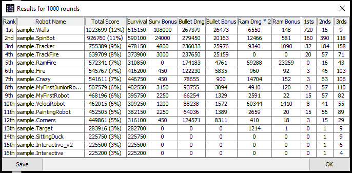
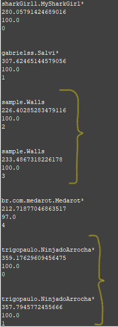
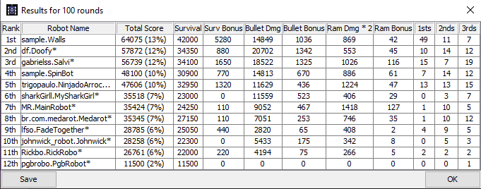
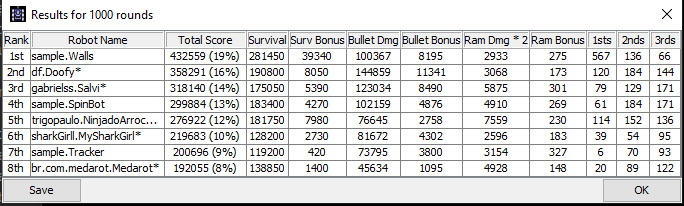

# Solutis Talent Sprint 2020
Robô de batalha criado para o Talent Sprint, programa de seleção de jovens talentos, da empresa Solutis.

## Sobre o Robocode
O robocode é uma engine avançada para simulação de batalha entre robôs.
Foi criado por uma divisão da IBM chamada Alpha Works, com a intenção de tornar mais divertido o aprendizado da linguagem de programação Java.
Hoje, o mesmo pode ser utilizado tanto em Java quanto em .Net.

## Tecnologias utilizadas neste projeto
 

## Distributed Version-Control System
O Git foi a tecnologia utilizada para gerenciar o repositório local deste projeto.

<strong>Nota:</strong> Durante o decorrer do processo não houve necessidade de "3-way merges" apenas "Fast Forward Merges", mas, apesar de não precisar utilizar recursos interessantes como 3-way merge ou precisar resolver conflitos mais complexos de versionamento, eu pude colocar em dia o hábito de trabalhar com o Git.

## Repository Hosting Service
O GitLab foi o sistema escolhido para hospedagem do repositório remoto do nosso Robô Doofy.
 
<strong>Nota:</strong> Eu não havia utilizado o GitLab anteriormente, mas aparentemente ele possui características interessantes como a possibilidade de configuração de CI, CD e integração com o Kubernetes.

# Robo Doofy
O nome do Robo criado para este projeto é Doofy e se você pensou no personagem do filme "Todo mundo em pânico" você acertou na mosca!  
      
Eu sei que parece piada, mas, dentro do contexto que irei apresentar neste documento, a referência faz muito sentido, afinal, o indivíduo "mais tonto" e que parece ter a menor capacidade de ser o culpado é, no final das contas, o real assassino.

## Analise inicial
A primeira analise de performance foi feita utilizando os robôs sample do próprio Robocode.
Durante o processo percebi que dois robôs se destacavam à princípio, um deles pareceu meio tonto, ficava girando sem parar, aparentemente sem rumo, seu nome é "Spinbot".
O outro praticamente não participava dos confrontos mais brutais porém se demonstrou muito eficaz em finalizar seus adiversários, este é o sample "Walls".
Partindo deste princípio, decidi estudar os códigos e características deles dois para utilizar como fonte principal, mas não única, no desenvolvimento do robô Doofy.

Ver estatísticas inicial:

  

<strong>Nota:</strong> Ao utilizar todos os sample robots ao mesmo tempo, não foi observado queda de FPS.

## Codificação
Utilizando um array de objetos, analisei os resultados obtidos pelo radar num percurso de 360 graus. Muitas vezes, ao completar uma volta inteira, o radar trouxe resultados duplicados

Ver imagem dos resultados:

 

<strong>Palpite:</strong> Esta característica vista acima pode significar que o objeto está se movimentando  na mesma velocidade do radar. Dessa forma o objeto fica registrado duplicadamente.

<strong>Nota:</strong>  Após algumas linhas de código e muitos pedidos de resposta para o sistema, percebi que métodos iniciados com "set" funcionam em paralelo na memória, o que fornece fluidez para a movimentação do robô, porém pode gerar inconsistências nos dados obtidos por codificadores recém apresentados ao sistema do robocode, como eu. 

## Analise final
Para a análise final decidi fazer uma pesquisa no GitLab dos outros participantes do desafio Talent Sprint de 2020, utilizando seus robôs e consequentemente seus códigos para verificar o desempenho de Doofy, observando assim as chances deste obter sucesso.
Por fim, me diverti bastante tentando codificar um sistema que pudesse identificar todos os inimigos em volta e depois mirar no mais próximo, porém, dado o curto espaço de tempo, resolvi, em detrimento do aprendizado, aproveitar o código Circular Targeting da própria robowiki para mirar e atirar, e estou orgulhoso de ter conseguido desenvolver um pequeno sistema que analisa o posicionamento no mapa e com isso altera o comportamento do robô.
O aproveitamento de Doofy nesta fase inicial também se mostrou satisfatória. Fiz duas simulações para verificar o desempenho de Doofy, uma de 100 rounds, pois havia muita queda de fps, e outra de 1000 rounds, igual a primeira, com os robôs que, na minha concepção, tinham os códigos mais limpos.

Ver Estatísticas finais:

   

 

<strong>Nota:</strong> Durante este processo presenciei quedas de FPS, possivelmente causadas por má implementação de códigos e funções nos robôs presentes na arena.

# Contribuições
Este repositório está sendo avaliado por [Alex Gamas](https://gitlab.com/alexgamas)

# Referências
[Sing Li - IBM](https://www.ibm.com/developerworks/library/j-robocode/index.html)

[Robocode Wiki](https://robowiki.net/wiki/Main_Page)

# Licença
[EPL](https://robocode.sourceforge.io/license/epl-v10.html)